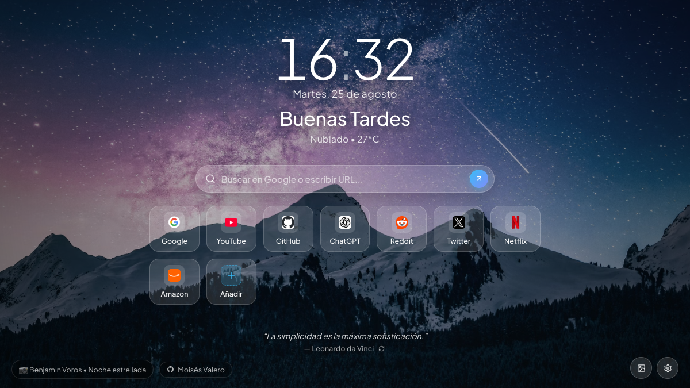
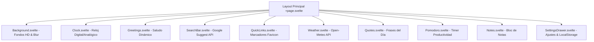

# ⚡ NovaTab — Modern Startpage & New Tab for Web Browsers

> **NovaTab** es una aplicación de nueva pestaña (Startpage) minimalista, hiperrápida y altamente personalizable inspirada en [Bonjourr](https://online.bonjourr.fr/), con **diseño Glassmorphism**, **buscador central configurable en tiempo real** (Google, Bing, DuckDuckGo, Yahoo y más), **fondos de pantalla dinámicos en HD**, **clima en vivo** y **gestión de marcadores rápidos**.

🌐 **Live Demo**: [https://start.moisesvalero.es](https://start.moisesvalero.es) (Vercel Backup: [https://novatab-five.vercel.app](https://novatab-five.vercel.app))

[](https://svelte.dev/)
[](https://vercel.com/)
[](LICENSE)
[](https://pnpm.io/)

<p align="center">
  
</p>

---

## ✨ Características Principales

| Característica                  | Descripción                                                                                                                         |
| :------------------------------ | :---------------------------------------------------------------------------------------------------------------------------------- |
| 🔍 **Buscador Multimotor**      | Buscador prominente con selector rápido de motor (Google, Bing, DuckDuckGo, Brave, Yahoo), autocompletado y atajo (`/` o `Ctrl+K`). |
| 🕒 **Reloj & Fecha Flexible**   | Reloj Digital y Analógico (12h/24h), segundos opcionales y saludo personalizado (_"Buenos días, [Nombre]"_).                        |
| 🖼️ **Fondos Dinámicos**         | Galería curada de alta resolución (Unsplash), control de desenfoque (_blur_), oscurecimiento (_overlay_) y cambio en 1 clic.        |
| 🔗 **Accesos Directos Pro**     | Tarjetas de marcadores visuales con favicons de alta resolución recuperados automáticamente. Modal para añadir/editar/borrar.       |
| 🌤️ **Clima en Vivo**            | Conexión con Open-Meteo API sin necesidad de API Key, con geolocalización o ciudad manual.                                          |
| ⚙️ **Panel de Ajustes Lateral** | Cajón deslizable para alternar visibilidad de cada widget, personalizar título/emoji de pestaña y exportar configuración JSON.      |
| ⏳ **Widgets de Productividad** | Temporizador Pomodoro, Bloc de Notas rápido persistente y Frases inspiradoras del día.                                              |

---

## 🎨 Vista Previa de la Interfaz


---

## 🏗️ Arquitectura de Componentes



---

## 🚀 Inicio Rápido (Desarrollo Local)

### Prerrequisitos

- Node.js >= 18.x
- `pnpm` (recomendado) o `npm`

### Instalación

```bash
# 1. Clonar el repositorio
git clone https://github.com/moisesvalero/novatab.git
cd novatab

# 2. Instalar dependencias
pnpm install

# 3. Iniciar servidor de desarrollo
pnpm run dev
```

Abre `http://localhost:5173` en tu navegador.

---

## 📦 Compilación y Despliegue en Vercel

```bash
# Probar compilación estática / SSR
pnpm run build

# Desplegar directamente con Vercel CLI
vercel --prod
```

---

## 🌐 Configurar NovaTab como Pestaña por Defecto

1. Copia la URL de tu proyecto desplegado (ej. `https://novatab.vercel.app`).
2. Instala una extensión de navegador para gestionar pestañas nuevas como **Custom New Tab URL** ([Chrome](https://chrome.google.com/webstore) / [Firefox](https://addons.mozilla.org)).
3. Configura la URL desplegada de NovaTab como tu dirección de nueva pestaña.

---

## 📄 Licencia

Este proyecto está licenciado bajo la **Licencia MIT**. Consulta el archivo [LICENSE](LICENSE) para más detalles.

---

## ❤️ Agradecimientos

- Inspirado en el maravilloso proyecto de código abierto [Bonjourr](https://online.bonjourr.fr/).
- Fotografías cortesía de [Unsplash](https://unsplash.com/).
- Iconos por [Lucide Svelte](https://lucide.dev/).
